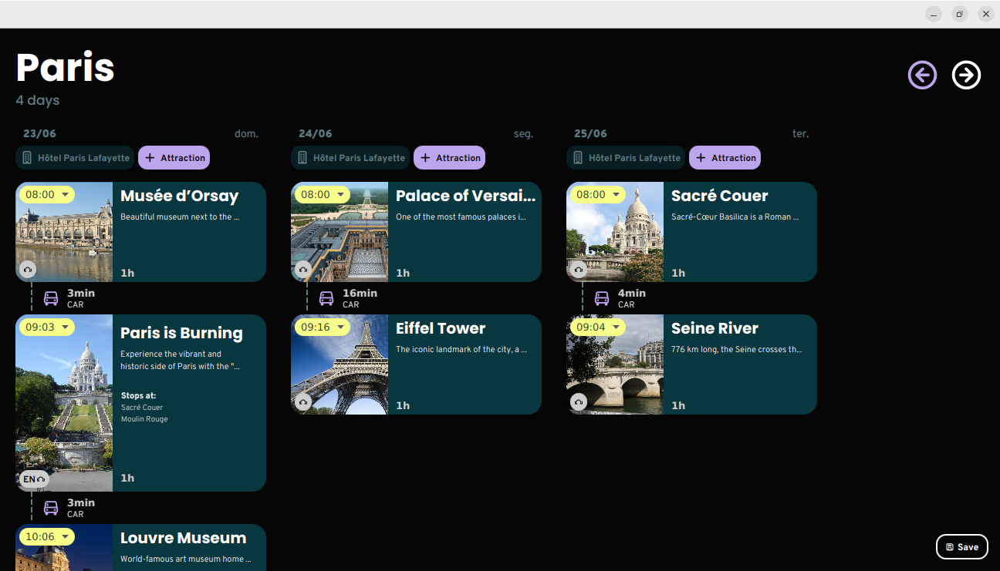

# mc322-project

# Travel Itinerary Planner


## Summary
This project, implemented in Java, is a practical travel itinerary planner designed to help users optimize their trips based on their preferences. The application offers suggestions for various activities, museums, restaurants, and cultural events in the chosen city, enabling users to create detailed itineraries with filters for prices and operating hours, and also calculate the most effective means of transport between selected destinations.

## Table of Contents
1. [About the Project](#about-the-project)
2. [Built With](#built-with)
3. [Getting Started](#getting-started)
4. [License](#license)
5. [Meta](#meta)

## About the Project
Upon launching the program, users are greeted with a modern and intuitive graphical interface built with JavaFX and customized with CSS. They can choose to create a new itinerary from scratch by selecting a city and travel dates or continue an existing itinerary by loading a saved XML file.

Key Features:
- **Create Itinerary**: Choose a destination city and travel dates to start planning from scratch.
- **Add Activities**: Browse through famous tourist spots with brief descriptions and photos, and add them to your itinerary.
- **Filters**: Apply filters based on category (museums, parks, restaurants, theaters, tourist sights) and price range.
- **Transport Calculations**: Automatically calculates the most efficient means of transport and the associated time and costs between activities.
- **Reorder Activities**: Easily change the order of activities and the application will recalculate timings and transport.
- **Save Itinerary**: Save your itinerary to an XML file for easy access later.

Technical Highlights:
- Extensive use of object-oriented programming principles such as relationships between classes, polymorphism, and composition.
- Implementation of design patterns including Singleton, Model-View-Controller (MVC), Strategy, and Factory Method.
- Custom exception handling for user inputs such as dates, times, and price limits.
- Serialization and deserialization of data using Jackson's `XmlMapper`.
- Utilized libraries: JavaFX, Kordamp, and Gluon.

## Built With
- **Java**: Core programming language.
- **JavaFX**: For building the graphical user interface.
- **CSS**: For custom styling of the interface.
- **Jackson**: For XML serialization and deserialization.
- **Kordamp**: To facilitate development with JavaFX.
- **Gluon**: For additional JavaFX functionalities.

## Getting Started
### Prerequisites
- Java Development Kit (JDK) 8 or higher
- Apache Maven
- IntelliJ IDEA

### Installation
1. Clone the repository:
   ```sh
   git clone https://github.com/your_username/your_repository.git
   cd your_repository
#### Installation
1. Open the project in IntelliJ IDEA. The java API used is 21.
2. Ensure Maven is installed and configured in your IDE.
3. Add JavaFX to the Maven project by including the following dependencies in your `pom.xml` file:
 ```xml
<dependency>
	<groupId>org.openjfx</groupId>
	<artifactId>javafx-controls</artifactId>
	<version>17.0.1</version>
</dependency>
<dependency> 
	<groupId>org.openjfx</groupId> 
	<artifactId>javafx-fxml</artifactId>
	<version>17.0.1</version>
</dependency>
```
4. In pom.xml you can view any additional libraries as well. Note that version might change but the project was built for the ones listed in pom exclusively.
5. Build the project.

### License

Distributed under the Apache 2.0 License. See `LICENSE` for more information.

### Meta

-   **Project authors**: Eduardo de Almeida Migueis, Vitor Okimasu Lisboa, Ana Margarida Diniz Silva Borges, Hugo Mateus Ribeiro Cardoso Veloso
-   **Professor**: Marcos Medeiros Raimundo
-   **Course**: MC322 - Object-Oriented Programming

© 2024 Eduardo de Almeida Migueis of entire code, Vitor Okimasu Lisboa, Ana Margarida Diniz Silva Borges, Hugo Mateus Ribeiro Cardoso Veloso